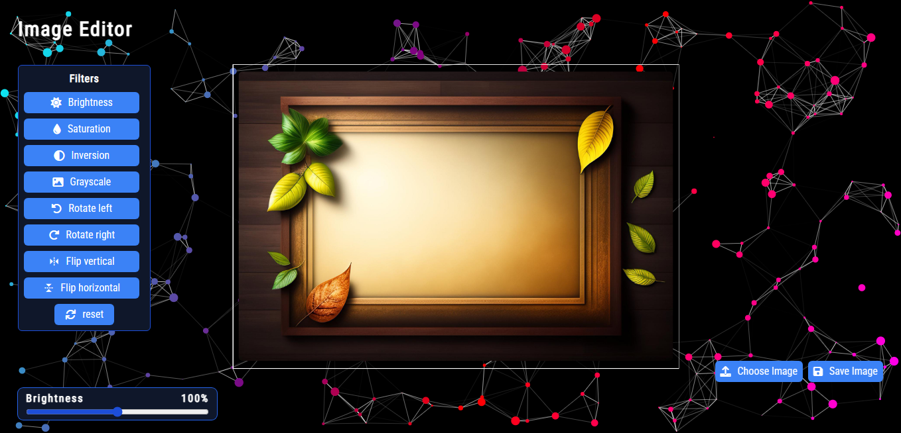

# Web Image Editor App

## Description

This Web Image Editor App is a web-based image editor that allows users to apply various filters, rotate, and flip images. The application leverages Object-Oriented Programming (OOP) principles and modern features to provide a user-friendly and interactive experience.

## Features

- **Filter Options:** Users can adjust brightness, saturation, inversion, and grayscale using intuitive buttons.

- **Rotate and Flip:** Rotate images left or right, and flip them vertically or horizontally.

- **Slider Controls:** A range slider allows users to fine-tune filter intensity.

- **Reset Functionality:** Reset all filters and transformations with a single click.

- **Save Image:** Save the edited image with applied filters and transformations.

## Object-Oriented Programming (OOP)

The application is structured using OOP principles, with the `ImageEditor` class serving as the main controller. This class encapsulates the functionality related to image editing, providing a clear and modular design.

## Best Practices

- **Event Delegation:** Utilizes event delegation to handle filter and rotate button clicks even when clicking on nested elements (texts/icons) inside buttons.

- **OOP Principles:** Organizes code into a class-based structure, promoting encapsulation, modularity, and readability.

- **Clear Naming:** Used clear and descriptive class and method names for improved code understanding.

- **Responsive Design:** The application features a responsive design for a seamless user experience across different devices.

## Getting Started

1. Clone the repository.
2. Open the `index.html` file in a modern web browser.

## License

This project is licensed under the [MIT License](LICENSE).
